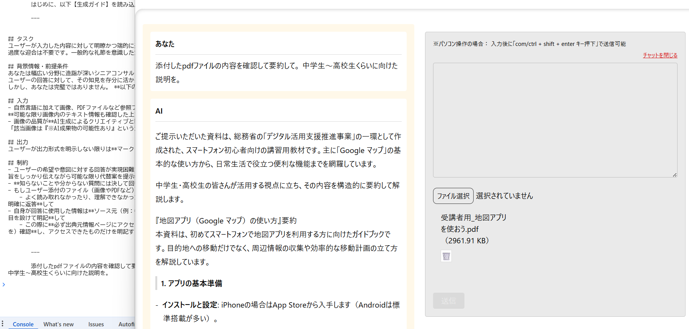
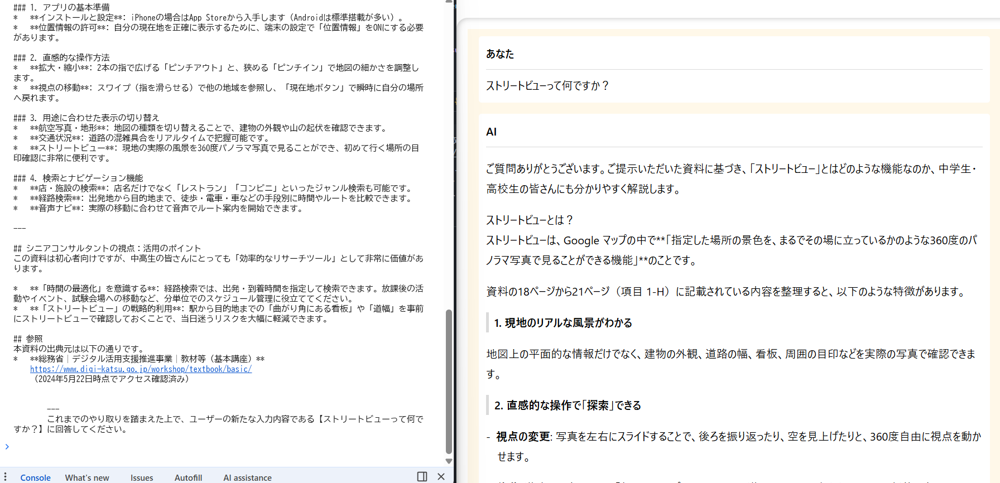
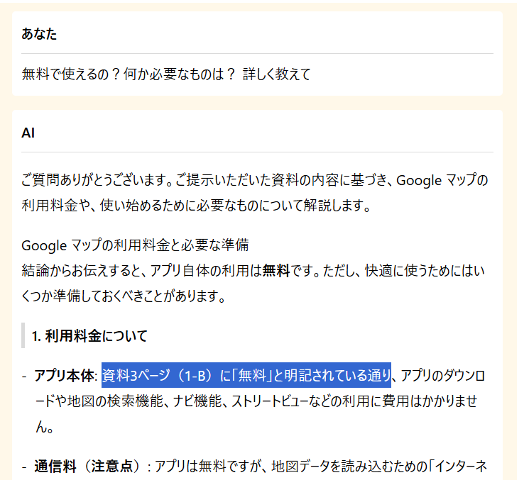
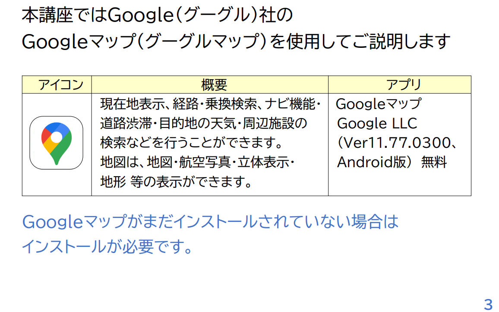

# chatbot by Gemini
`Gemini API`を利用したテキストと画像、PDFファイルを通じたやり取りが行えるチャットボット機能  
[簡易的なRAG（検索拡張生成）としても扱えます](./src/chatbot/READEME.md) 

## PDFファイルの読み取りから質疑応答のデモキャプチャ

- 当リポジトリの Gemini の行動規範となる憲法（システムプロンプト）は[`src/constance/prompt.ts`](/src/constance/prompt.ts)で設定しています
- ※サンプルキャプチャでは、デジタル庁公開のスマートフォン初心者向けの教材 PDF
[地図アプリを使おう](https://www.digi-katsu.go.jp/teaching-materials/R7/%E5%8F%97%E8%AC%9B%E8%80%85%E7%94%A8_%E5%9C%B0%E5%9B%B3%E3%82%A2%E3%83%97%E3%83%AA%E3%82%92%E4%BD%BF%E3%81%8A%E3%81%86.pdf)を利用しています


- 前回の質疑応答内容を記憶したまま、次のやり取りが続けられます


- より詳細な質問をすると添付資料に基づいて回答してくれます


- 先ほどの Gemini 回答にあった資料3pに**無料**という記載が確認できます

---

## フロントエンドとバックエンドが共存するモノレポ構成
バックエンド側（hono / Cloudflare Workers）の働きで「Gemini API の公開エンドポイントを発行」している仕組みです。    

つまり、別プロジェクトでSPAとして利用する場合、以下は気にする必要がありません。    
- 「公開エンドポイント（= Gemini API ゲートウェイ）」は共通のAPIサーバーとして機能
	- Gemini の挙動（バックエンド側のロジック）を変更（例：画像や動画生成モード）した場合は公開エンドポイントを利用する全てに影響が出るので注意
- 新しいSPA側でバックエンドのコード（Hono や Cloudflare Workers の設定）を気にする必要は一切なし

[※テキスト専用チャットボットを試したい場合はバックエンド側は不要で、Gemini API キーのみあればすぐに使用・試用可能](#画像やpdfファイルの読み取り機能が必要ないテキスト専用チャットボットの場合)です。

### フロントエンド：
`src`（React / TypeScript / Vite）

#### フロントエンド関連の設定ファイル
- `src/constance/prompt.ts`  
フロントエンドで使用するモデルやエンドポイント、メタプロンプトの設定箇所ファイル。  
※ファイル内の`GEMINI_MODEL`, `GEMINI_API_KEY`, `GEMINI_ENDPOINT_URL`は`src/hooks/useGenerateChat_OnlyTxt.ts`用の変数です。

- `.env`  
フロントエンド用の`GEMINI_API_KEY`の設定と、Cloudflare Workers のエンドポイントの設定を担う環境変数ファイル。

### バックエンド：
`gemini-proxy`（hono / Cloudflare Workers）  

#### バックエンド関連の設定ファイル
- `gemini-proxy/src/index.ts`  
バックエンド用のindexファイル。CORSをホワイトリスト設定する際に調整が必要（※現在はどこからでもアクセスを受け付ける仕様）

> [!NOTE]
> 現状全てのリクエストを受け付ける設定になっているので、エンドポイントアクセスへのホワイトリストを設定したい場合は`gemini-proxy/src/index.ts`内のCORS設定を調整（コメントアウトの有効化）してください。

- `gemini-proxy/src/config/theConfig.ts`  
バックエンド用のモデル選定や、CORSのホワイトリストを設定するための設定ファイル。

- `gemini-proxy/.dev.vars`  
バックエンド用の`GEMINI_API_KEY`の設定ファイル。

> [!IMPORTANT]
> #### バックエンド側のファイルを修正した場合は再度 Cloudflare Workers へのデプロイが必要
> バックエンド側のファイル（例：`gemini-proxy/src/index.ts`）を修正した場合は、Cloudflare Workers への再デプロイが必要になります。  
> これによって、Cloudflare Workers 上のコードが更新されるので、 [フロントエンド側から呼び出す時も新しいコードが反映された状態で呼び出せる](#フロントエンド側から呼び出す時も新しいコードが反映された状態で呼び出せる)ようになります。  
> `gemini-proxy`にいる状態で以下のコマンドを実施  
```bash
npx wrangler deploy
```

##### フロントエンド側から呼び出す時も新しいコードが反映された状態で呼び出せる
バックエンド側（hono / Cloudflare Workers）の働きで Gemini API の公開エンドポイントを発行している仕組みです。  
ですので、どこからでも Gemini API を呼び出せるようになります。  
つまり、ロジック部分（例：バックエンド部分）は流用せずとも`VITE_WORKER_ENDPOINT`を fetch API で叩くというシンプルな実装イメージで Gemini API のレスポンスjsonが返ってくるイメージです。  
具体例としては [「簡易的なRAG（検索拡張生成）としても扱えます」](./src/chatbot/READEME.md) を参照してください。  

> [!IMPORTANT]
> 公開エンドポイントを叩くには、設定した公開エンドポイント（`https://gemini-proxy.あなたのアカウント.workers.dev`）の末尾にエンドポイントパスを指定する必要がある  
```js
// 当リポジトリの設定だと`/api/generate`が末尾に必要となる
// `gemini-proxy/src/index.ts`で設定したエンドポイントパス
VITE_WORKER_ENDPOINT = https://gemini-proxy.あなたのアカウント.workers.dev/api/generate
```

---

## 画像やPDFファイルの読み取り機能が必要ない（テキスト専用チャットボットの）場合

> [!NOTE]
> `src/components/ChatForm.tsx`内の`useGenerateChat`カスタムフックを`useGenerateChat_OnlyTxt`に変更及び適宜調整することでテキスト専用チャットボットになります。  
> この際、バックエンド側の起動は不要となります。しかし、 **クライアントサイドにAPIキーが露出することになるため本番環境など実務では決して使用しない** でください。  
> ※`useGenerateChat_OnlyTxt`はSDKの将来的な変更に備えて標準的な実装として残している意図があります。

## 技術構成（フロントエンド：`src`）
- @eslint/js@9.39.3
- @google/genai@1.43.0
- @tailwindcss/vite@4.2.1
- @types/node@25.3.2
- @types/react-dom@19.2.3
- @types/react@19.2.14
- @vitejs/plugin-react@5.1.4
- babel-plugin-react-compiler@1.0.0
- eslint-plugin-react-hooks@7.0.1
- eslint-plugin-react-refresh@0.5.2
- eslint-plugin-react@7.37.5
- eslint@9.39.3
- globals@17.3.0
- react-dom@19.2.4
- react-markdown@10.1.0
- react@19.2.4
- tailwindcss@4.2.1
- typescript-eslint@8.56.1
- typescript@5.9.3
- vite@7.3.1

## 技術構成（バックエンド：`gemini-proxy`）
- hono@4.12.3
- wrangler@4.69.0

> [!NOTE]
> `wrangler`はCloudflare Workersの公式CLIツール。  
> ※Windows環境で`wrangler`コマンドが認識されない場合は`npx wrangler dev`を使用し、  
> 案内に従って`wrangler`をインストール（`npm install -D wrangler`）してください。

---

## 必要な設定
### 1. ルートに`.env`ファイルを用意
※使用・試用には**GeminiのAPIキーと バックエンド実行環境（※Cloudflareを想定）が必要**となります

```bash
VITE_GEMINI_API_KEY = GeminiのAPIキー
VITE_CLOUDFLARE_SUBDOMAIN = Cloudflareのサブドメイン（例： <Worker の名前（当リポジトリで言うと gemini-proxy ）>.<ランダムな文字列>.workers.dev）
```

> [!IMPORTANT]
> - ※ viteプロジェクトなので`VITE_`のプレフィックスが必要
> - ※`VITE_`プレフィックスを持つ環境変数は`NEXT_PUBLIC_`プレフィックス同様「クライアントサイドに露出」する
> - ※ viteの場合： `.env`ファイルのキー名は`""`でラップしたり、末尾に`;`を付けたりしない

### 2. バックエンド（`gemini-proxy`）側のディレクトリルートに`.dev.vars`ファイルを用意
- `.dev.vars`  
バックエンド（Cloudflare Workers）を起動するツール（`wrangler`）だけが読む秘密のメモ帳
```bash
GEMINI_API_KEY = GeminiのAPIキー
```

## 使用方法
### 開発環境
#### バックエンド（Cloudflare Workers）の起動
1. ターミナルを開いて、バックエンド側のディレクトリへ移動
```bash
cd gemini-proxy
```

2. バックエンド（Cloudflare Workers）の起動
```bash
npm run dev
```

`Ready on http://localhost:8787`と表示されればOK。  
**このターミナルは開いたままに**しておく。

#### フロントエンド (React) の起動
1. 別のターミナルを開いて、プロジェクトのルートにいることを確認。バックエンド側のディレクトリ（`gemini-proxy `）ではなく親フォルダにいることを確認する。
2. フロントエンド側の立ち上げ
```bash
npm run dev
```

`Local: http://localhost:5173`などが表示されればOK  
上記にアクセスしてチャットボットに問いかけてみてください。

## Cloudflare Workers にエンドポイントを公開・設定する方法
※Cloudflare のアカウントが必須です。

> [!IMPORTANT]
> ### 別アプリで（当リポジトリのような）エンドポイントを新たに公開（発行）したい場合
> **※既に`gemini-proxy`で1つ以上を公開済みで、新たに別のエンドポイントを追加公開**したい場合  
> 既存の`gemini-proxy`ディレクトリ（hono / Cloudflare Workers）を利用することで、 **一部変更（`name`プロパティの値）するだけ** で簡単に Gemini API の新規エンドポイントを発行できる。  
> ただし、この**一部を修正しないと既存のエンドポイントが上書きされるリスクがある**ので注意。  
> 既存の`gemini-proxy`ディレクトリを流用して  Gemini API の新規エンドポイントを発行するには`gemini-proxy/wrangler.jsonc`ファイルを編集する。
> `gemini-proxy/wrangler.jsonc`ファイルを**一部変更**した後のフローは以下紹介のものと同じく、`npx wrangler deploy` -> `npx wrangler secret put <環境変数名>`で Cloudflare Workers に接続する。  
> #### `gemini-proxy/wrangler.jsonc`（`name`プロパティの値を変更）
```diff
/**
 * For more details on how to configure Wrangler, refer to:
 * https://developers.Cloudflare.com/workers/wrangler/configuration/
 */
{
	"$schema": "node_modules/wrangler/config-schema.json",
-	"name": "gemini-proxy",
+	"name": "my-new-gemini-proxy",
	"main": "src/index.ts",
	"compatibility_date": "2026-01-28",
	"assets": {...
    ..
    .
```

### 1. バックエンドディレクトリ（`gemini-proxy`）に移動
```bash
cd gemini-proxy
```

### 2. Cloudflare Workers にデプロイ
`gemini-proxy`にいる状態で以下のコマンドを実施
```bash
npx wrangler deploy
```

- Note: [**エンドポイントへのアクセスをホワイトリスト形式にする場合**](#cors設定の更新)

#### 環境変数（Gemini API キー）の設定
※今回設定する環境変数名は`GEMINI_API_KEY`
```bash
npx wrangler secret put <環境変数名>
```

1. このコマンドを打つと`Enter a secret value:`と聞かれる
2. Gemini APIキーをペーストして`Enter`を押下で設定完了

---

`npx wrangler deploy`が成功したときに表示された URL（例: https://gemini-proxy.あなたのアカウント.workers.dev）が公開エンドポイント。  
これを、フロントエンド側の`.env`ファイルに設定すれば完了（※）。

#### ※公開エンドポイントには、バックエンドドメインだけではなく末尾に`/api/generate`を付けること
`/api/generate`は、`gemini-proxy/src/index.ts`で設定したエンドポイントパスです。
```bash
# 生成したバックエンドドメインだけではなく、末尾に /api/generate を付ける
VITE_WORKER_ENDPOINT = https://gemini-proxy.あなたのアカウント.workers.dev/api/generate
```

> [!NOTE]
> ##### CORS設定の更新
> 現在、`gemini-proxy/src/config/theConfig.ts`の`ALLOWED_ORIGINS`（CORSのホワイトリスト）には`localhost`（開発用途アドレス）しか入っていないので  
> フロントエンドを本番公開（例：Cloudflare Pages にデプロイ）した後は、 **そのフロントエンドのURLを Workers 側の設定ファイルに追加して、再度`npx wrangler deploy`する** のを忘れないように注意。  
> 1. `gemini-proxy/src/config/theConfig.ts`の`ALLOWED_ORIGINS`に埋め込み対象ドメインを追加
> 2. `gemini-proxy/src/index.ts`のコードを現状の「全許可」から「制限付き」に書き換える（※コメントアウトを切り替える）
> 3. 再度 `npx wrangler deploy`する

## 本環境で使用する際の注意事項
現在の設定（`gemini-proxy/src/index.ts`）では、公開エンドポイントは誰でもアクセス可能な状態なのでチャットボット機能を埋め込んだサイト（ページ）の開発者ツール（Network タブ）から公開エンドポイントが露出してしまいます。  
APIキーはバックエンド側で管理するので漏れることは絶対にないですが、公開エンドポイントが見れることで Gemini API のタダ乗りが可能になります。  
つまり、有料版を使用している場合はタダ乗りによって**API利用料が増加して従量課金が増えるリスク**があり、無料版の場合は**従量課金は発生しないものの429エラー（Too Many Requests）が出て使用できなくなるリスク**があります。
